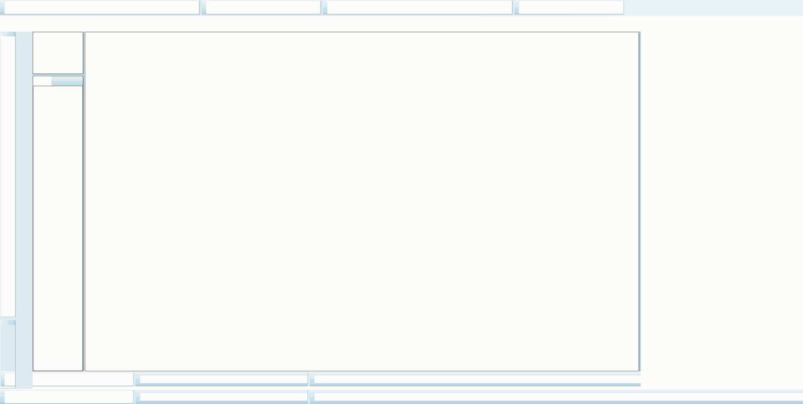
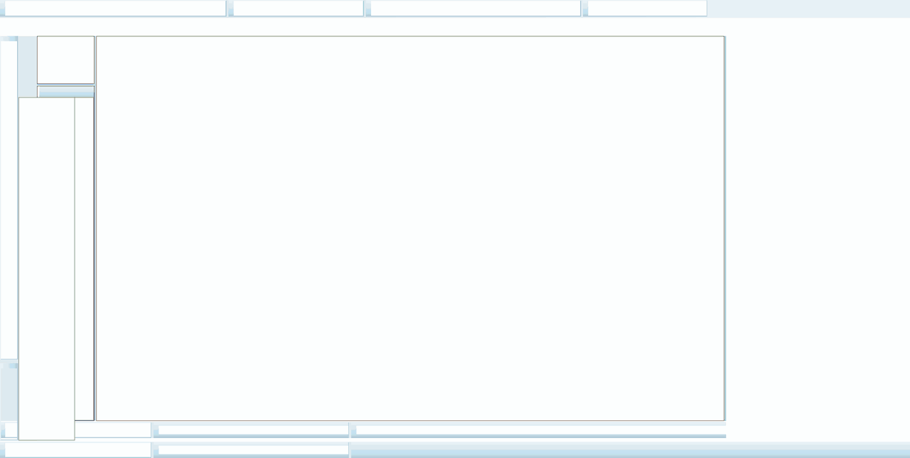
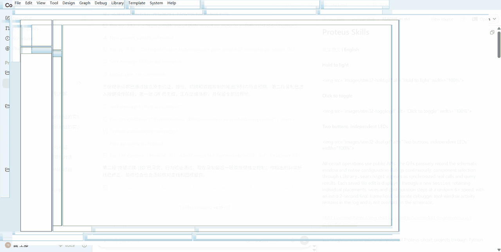

# Proteus Skills

[简体中文](README.md) | **English**

<p align="center">
  
  
  
</p>


[](LICENSE)

Let AI agents create, edit, and verify real Proteus circuit projects through Python.

**Undergraduates, particularly those studying Electrical Engineering(EE), often find themselves struggling with Proteus simulations. Today, we’re introducing Proteus skills! This skill allows AI to carry out Proteus simulations. Don’t let tedious wiring and layout hold back the brilliant ideas in your head!**

Proteus Skills provides workflows for schematic editing, microcontroller simulation, button and switch control, and waveform extraction. Agents use [proteus-automatic-api](https://github.com/kudoumakoto6523-design/Proteus_automatic_package) to deliver editable `.pdsprj` projects, verification scripts, and actual simulation results.

This repository contains the skill instructions and reference examples. The Python library is maintained separately; the agent checks and installs it from the official GitHub repository during initial setup. The repositories do not need to be adjacent.

This tool is functional, but there are numerous areas that require refinement. If you are also struggling with simulation and would like to use AI to solve this problem, please contact me at: `kudoumakoto6523@gmail.com`
## Requirements

- **Windows**, with Proteus and the device models required by your circuit installed.
- **Python 3.10+**, preferably 3.12. The agent checks the interpreter and helps install it if missing. You do not need to obtain library source code or a wheel first.
- **Codex**: the instructions below cover installing and invoking the skill in Codex.

The workflows have been verified with **Python 3.12 / Proteus 8.16 SP3 (8.16.36097)**. Timed simulation and interactive controls require supported Proteus DLL versions; compatibility with other builds has not been verified. Proteus software, models, official samples, and third-party firmware are not bundled with this skill; this repository provides only original demo firmware.

## Installation

### 1. Install the skill

Send this request in Codex:

```text
Use $skill-installer to install https://github.com/kudoumakoto6523-design/proteus-skills
The repository root is the skill directory. Install it with the name proteus-skills.
```

Alternatively, download this repository and place `SKILL.md`, `agents/`, `references/`, `scripts/`, and `LICENSE` together in a folder named `proteus-skills` under Codex's `$CODEX_HOME/skills/`. The default location is `~/.codex/skills/proteus-skills/`. The installed entry point should be `proteus-skills/SKILL.md`. Keep `examples/stm32/` as well when running the repository demos.

### 2. Ask the agent to prepare the environment and start

After installing the skill, send this request in your next message:

```text
Use $proteus-skills. I only have Proteus installed. Check Python and the library first;
if needed, install proteus-automatic-api from the official GitHub repository specified
by the skill, verify it, and continue with my task.
Create an STM32 project where pressing a button turns an LED on and releasing it turns it off.
```

The agent runs the setup script bundled with the skill. If the library is missing, it creates a virtual environment in the task directory, resolves the latest default-branch commit from the [official GitHub repository](https://github.com/kudoumakoto6523-design/Proteus_automatic_package), checks the package name and API, and installs that commit's source ZIP. Git is not required, and installation does not wait for a PyPI release. The agent then verifies imports, records the version and commit, and continues the circuit task in the same run. It does not stop at installation instructions or wait for you to install the library manually.

A working installation is reused. To update, ask the agent to update `proteus-automatic-api` from the official GitHub repository and verify it; a newer commit can be installed even if its version number is unchanged. See the [installation workflow](references/distribution.md#首次安装与更新) for commands, old-package migration and offline installation.


## Before you start

Provide the agent with the project or template, the Proteus executable location, and an output directory. For MCU tasks, also provide the firmware and target pins. Creating a circuit requires a template containing the relevant device definitions; the resistor and capacitor example uses the official `Rescap.pdsprj` sample.

Use actual paths on your machine. Outputs belong in your working directory. The library's built-in paths do not automatically adapt to every installation; see [SKILL.md](SKILL.md#环境与版本) for path parameters and known limitations.

## Prompts for the three scenarios

Use the common requirements below, followed by one scenario prompt. The original firmware C sources, HEX files and build scripts are in [examples/stm32](examples/stm32); place the outputs compiled for your run under the task’s `firmware/` directory. The official STM32 template and device models come from your local Proteus installation.

An independent agent rebuilt and verified the three scenarios using only the public prompts, confirming output sequences `0→1→0→1→0`, `0→1→1→1→0→0`, and `00→10→11→01→00`; see the [independent verification record](examples/stm32/verification.json).

The verified prompts below cover the full build and original recording; published GIFs follow the editing and display rules described at the top of this README.

### Common requirements

```text
Use $proteus-skills and only public proteus_automatic_api APIs to create an empty project from a confirmed STM32 template that has been saved natively. Query and select the MCU, BUTTON, resistor and LED with Library.search/get, reuse existing definitions, and place and wire each item individually. Configure a 3.3 V VCC/VDD rail: bind VCC, VDD and VDDA to it, and VSS and VSSA to GND. Connect NRST, VBAT and VREF+ to the supply, and BOOT0 and VSS to ground. Bind the buttons before saving and reopening, then configure the firmware using the HEX compiled for this run. Start each resistor at 470 ohms and change it to 330 ohms through Session.set_properties. Keep components, wires and text clearly spaced inside the drawing frame; use label_offsets where needed. Passively record the continuous workflow from the blank sheet through actual selection, individual placement, wiring, configuration and verification. A new Session may display each saved file edit; show real API calls and query results in a synchronized log. Do not use Computer Use, private helpers or completed screenshots to fabricate the process. Save, close, reopen, check the project and export a native SDF, then verify the behavior below using actual GPIO logs. Deliver the project, HEX, script, SDF, validation records and GIF without changing the template.
```

### Hold to light

```text
Build an STM32F103R6 hold-to-light example using firmware/hold.hex compiled for this run. Connect normally open BUTTON SW1 between 3.3 V and U1.PA0-WKUP; the firmware enables PA0's internal pull-down. Connect U1.PA5 through R1 to D1's anode and ground D1's cathode. Follow the common requirements to select, place, wire, bind and configure everything from an empty sheet. Run successive stages: initially released, press SW1, release SW1, press again, release again. Continue simulation after each action and record actual simulation times. Verify PA5 levels 0→1→0→1→0 from this run's GPIO logs, with each response in the interval after its input change. Button state or a netlist alone does not prove the LED behavior. Record both press-on/release-off cycles and retain structural and response evidence.
```

### Click to toggle

```text
Build an STM32F103R6 single-button toggle example using firmware/toggle.hex compiled for this run. Connect normally open SW1 between 3.3 V and U1.PA0-WKUP, with PA0's internal pull-down enabled. Connect U1.PA5 through R1 to D1's anode and ground the cathode. Follow the common requirements to build the project from an empty sheet, including changing R1 from 470 to 330 ohms through the native property API. The firmware toggles PA5 only on a button rising edge. Verify six successive stages: initially released, first press, continue holding, first release, second press, second release. Continue simulation in every stage and require PA5 levels 0, 1, 1, 1, 0, 0. In particular, holding or releasing must not cause another toggle. Use actual GPIO events and simulation times from this run; absence of a new event alone does not imply a low level. Record the entire build and all six stages.
```

### Two buttons, independent LEDs

```text
Build an STM32F103R6 two-button independent LED example using firmware/dual.hex compiled for this run. Connect normally open SW1 and SW2 from 3.3 V to U1.PA0-WKUP and U1.PA1 respectively; the firmware enables both internal pull-downs. Connect U1.PA5 through R1 to D1's anode and U1.PA6 through R2 to D2's anode, grounding both cathodes. Leave clear space between the two channels. Follow the common requirements to place and wire each item, bind both buttons and change both resistors from 470 to 330 ohms through the native API. Run five stages: both released, press SW1, keep SW1 pressed and press SW2, release SW1, release SW2. Continue simulation after every action. In PA5, PA6 order, require output vectors 00→10→11→01→00 and check that operating one channel does not incorrectly change the other. Record the full build, configuration and all five states, verifying independent control with this run's GPIO logs and actual event times.
```

## Capabilities

| Task | Supported workflow |
| --- | --- |
| Project editing | Create or open supported `.pdsprj` files; edit components, properties, positions, wires, and terminals; save and reopen for verification |
| Connectivity checks | Query devices and pins, export native Proteus SDF netlists, and verify network connections |
| MCU simulation | Inspect and load ELF / HEX firmware; start, stop, pause, and run for a specified duration; read supported GPIO logs |
| Buttons and switches | Bind binary controls, press, release, or toggle them, and continue simulation to verify downstream responses |
| Waveform extraction | Export CSV data from existing graphs and probes, and read voltage, current, and sampled values |

All Proteus operations use the public `proteus_automatic_api` API, which drives real Proteus processes for netlists and simulation. Agents must not fill API gaps with Computer Use, OCR, screen coordinates, or other GUI automation. Unsupported operations are reported explicitly. Recording tools only capture passively.

## Known limitations

- Structural editing supports recognized single-user-sheet projects with CDB v7 and FILEVER 840/847. Rewriting projects with unknown objects, multiple sheets, or multi-unit structures may be rejected.
- Finding a device in the library does not establish that it can be imported or simulated. Automatic routing covers a limited set of orthogonal paths.
- Six types of binary controls are supported. They share 10 actuator key slots, using two slots per control, for a maximum of five controls. Existing bindings reduce the available capacity.
- Analog measurements require existing graphs and probes. There is no general ERC, arbitrary graph or probe creation, general live pin-voltage reading, or schematic image export API.

Control state, netlist connectivity, and actual electrical response are verified separately. Agents should report results supported by the projects, logs, and data produced for the current task.

## Repository contents

The skill instructions and detailed workflow references are currently written in Chinese.

| File | Purpose |
| --- | --- |
| [examples/stm32](examples/stm32) | Original firmware sources, HEX files, and build scripts for the three button and LED scenarios |
| [images](images) | Shared directory for the README demo GIFs |
| [scripts/ensure_library.py](scripts/ensure_library.py) | Check, install or update the library and return the Python path for the task |
| [SKILL.md](SKILL.md) | Agent entry point, task selection, operation order, and verification requirements |
| [agents/openai.yaml](agents/openai.yaml) | Display name and short description in Codex |
| [references/api-workflows.md](references/api-workflows.md) | Examples for project editing, netlists, firmware, and measurements |
| [references/interactive-controls.md](references/interactive-controls.md) | Button and switch binding, timing, and response verification |
| [references/distribution.md](references/distribution.md) | Library installation, version matching, migration, and separate distribution conventions |

## License

The original skill documentation and examples in this repository are licensed under the [MIT License](LICENSE). The Python library is distributed separately. Proteus software, device models, third-party samples, and firmware remain subject to their respective licenses.
